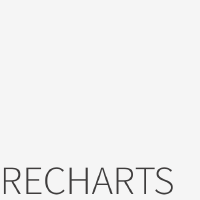

<p align="center"></p>

# Recharts engine for MyBI

Recharts — clean, composable React cartesian + part-to-whole charts: bar, line, area, scatter, composed and pie/donut, with crisp SVG output that stays razor-sharp at any zoom.

The MyBI **Recharts chart adapter** — the per-library draw that renders a MyBI `ChartSpec`
with [Recharts](https://recharts.org), built against the MyBI chart host SDK.

It is distributed as a signed `.mybiadapter` (a zip of `manifest.json` + `bundle.js` +
`signature.json`), downloaded on demand by MyBI and verified (Ed25519) before it runs. The
draw reads React, Recharts and the host from globals the app injects — it bundles none of them.

## Releases

The `recharts.mybiadapter` asset on each release is the signed adapter. Releases are published
by CI (`github-actions[bot]`) only after the signature verifies against the MyBI public key.

## Verify

```sh
node scripts/verify-adapter.mjs recharts.mybiadapter
```

MIT.

## Source

The readable adapter source (the per-library draw, built against the MyBI chart host SDK) lives in
`src/`. The published `.mybiadapter` is this source **bundled + minified + signed** by MyBI CI — the
minification/packaging is the build step, not what we author. The library itself (echarts/recharts)
is upstream's official build (see ACKNOWLEDGEMENT).
